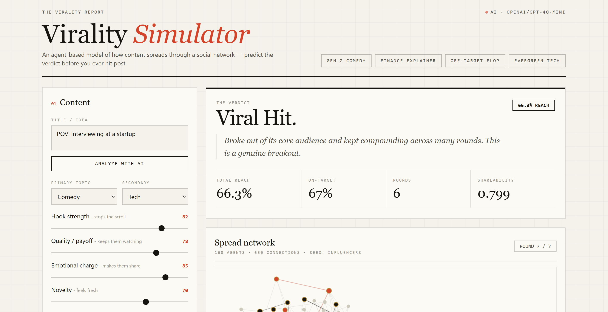
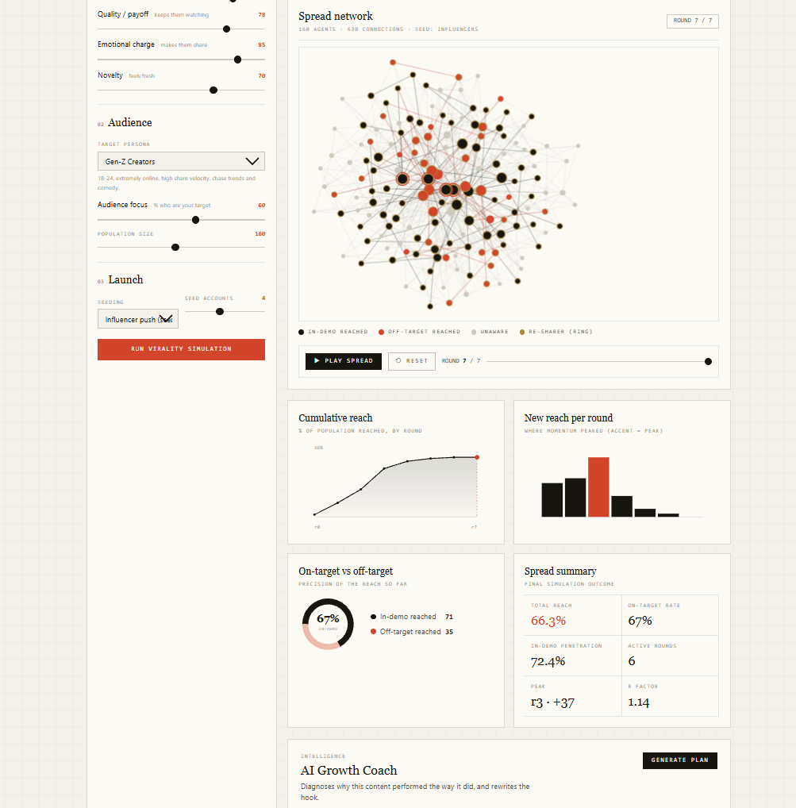

# Virality Simulator

**Predict how a piece of content spreads through a social network — before you ever hit post.**

Describe a piece of content (topic, hook, quality, emotion) and a target audience, and the app runs an agent-based simulation of the content diffusing through a synthetic social graph. It plays the spread back round-by-round on an animated network map and delivers a verdict — **Viral Hit, Slow Burn, Niche Hit,** or **Didn't Catch** — with detailed metrics, plus an optional **AI Growth Coach** that diagnoses the result and rewrites your hook.

  

---

## Screenshots





---

## Features

1. **Describe the content** — primary/secondary topic plus four research-backed levers (hook strength, quality, emotional charge, novelty). Or paste a caption and hit **Analyze with AI** to auto-fill them.
2. **Pick the audience** — one of 7 personas, audience focus, population size, and seeding strategy (organic vs. influencer push).
3. **Run the simulation** — the backend builds a scale-free social graph, seeds it, and runs an Independent Cascade diffusion.
4. **Watch it spread** — an animated force-directed network graph lights up round by round (in-demo reached, off-target reached, re-sharers). Scrub or replay any round.
5. **Read the verdict** — total reach, on-target precision, in-demo penetration, R-factor, and peak round, with a plain-English summary.
6. **Consult the AI Growth Coach** — a diagnosis, three concrete tactics, and a rewritten hook (falls back to deterministic recommendations without an API key).

Four one-click presets demonstrate each outcome archetype.

---

## Getting started

Requires Node.js 18+.

```bash
npm run install:all      # installs root, server, and client deps
npm run dev              # starts API (:3001) and frontend (:5173) together
```

Open **http://localhost:5173**.

```bash
npm run engine:demo      # run the engine standalone and see all 4 archetypes
npm run build            # production build of the frontend
```

### Enabling AI features (optional)

The app runs fully without an API key — AI features fall back to deterministic logic. To enable live AI:

1. `cd server`
2. `cp .env.example .env`
3. Set `OPENROUTER_API_KEY` in `.env` (keys available at https://openrouter.ai/keys; free-tier models supported)

The header shows a live indicator when AI is enabled.

---

## Tech stack

| Layer | Choice |
|---|---|
| Frontend | React 18, Vite, Tailwind CSS |
| Visualization | Canvas rendering with a custom force-directed layout; SVG charts |
| Backend | Node.js, Express |
| Simulation | Dependency-free JavaScript engine |
| AI (optional) | OpenRouter (gpt-4o-mini by default), with deterministic fallbacks |

---

## Architecture

```
virality-simulator/
├── server/
│   ├── index.js                 Express API
│   ├── .env.example             copy to .env to enable AI
│   ├── engine/                  core simulation (pure JS, no dependencies)
│   │   ├── rng.js               seedable PRNG (reproducible runs)
│   │   ├── topics.js            interest space + cosine affinity
│   │   ├── personas.js          7 audience personas + audience generation
│   │   ├── content.js           turns creator inputs into a content vector
│   │   ├── graph.js             Barabási–Albert scale-free network builder
│   │   ├── simulate.js          Independent Cascade diffusion
│   │   ├── verdict.js           metrics + outcome classifier
│   │   ├── index.js             orchestrator: config → full JSON result
│   │   └── demo.js              CLI harness that validates the archetypes
│   └── llm/                     optional AI layer (degrades gracefully)
│       ├── openrouter.js        client; returns null (→ fallback) if no key
│       ├── analyze.js           infer topic + levers from free text
│       └── coach.js             diagnosis + tactics + rewritten hook
└── client/
    └── src/
        ├── App.jsx              state, playback loop, presets
        ├── lib/forceLayout.js   Fruchterman–Reingold force-directed layout
        └── components/          InputPanel, NetworkGraph, Dashboard,
                                 VerdictCard, ReplayControls, AiCoach
```

The simulation engine has no framework dependencies, so the same code powers the API, the CLI demo, and the tests. The AI layer is strictly additive — every AI call has a deterministic fallback.

---

## API

| Method | Route | Purpose |
|---|---|---|
| GET | `/api/health` | Liveness check |
| GET | `/api/status` | Whether AI is enabled |
| GET | `/api/options` | Personas and topics for the UI |
| POST | `/api/simulate` | Run one simulation → graph, rounds, verdict |
| POST | `/api/analyze` | (AI) Infer content fields from free text |
| POST | `/api/coach` | (AI) Diagnosis, tactics, rewritten hook |

---

## How the model works

**The network** is scale-free, built with Barabási–Albert preferential attachment and biased so high-influence agents become hubs — mirroring the structure of real social graphs.

**The content** is a distribution over 8 topics plus a `shareability` scalar blended from hook, quality, emotion, and novelty.

**The agents** each have an interest vector, a susceptibility, a share-drive, and an influence score. A configurable fraction are in-demo (the target audience); the rest are general public, allowing reach to be measured as on-target vs. off-target.

**The spread** follows an Independent Cascade model. Each round, every agent who became a sharer in the previous round gets one chance to transmit to each unaware neighbour:

```
p(transmit) = base
            × affinity(content.topics, viewer.interests)   // do they care?
            × viewer.susceptibility                         // are they receptive?
            × content.shareability                          // is it good?
            × senderPush                                    // how loud is the sender?
```

A viewer who receives the content is **reached**, but only becomes an active **re-sharer** — keeping the cascade alive — if the content clears their personal share threshold. This mechanic is what separates outcomes: strong but narrow content thrives inside its niche yet never re-shares into the mainstream, producing a **Niche Hit** rather than a breakout.

Runs are fully reproducible: a fixed seed yields an identical spread, enabling replay and fair A/B comparison.
